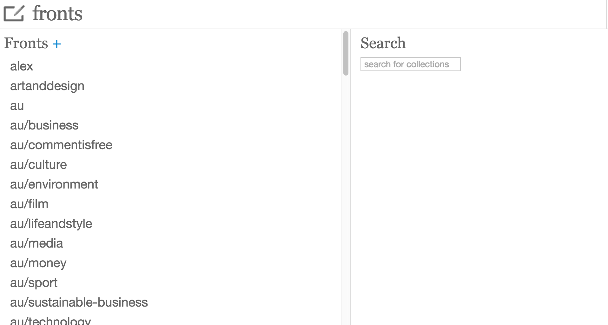

# Instructions for developers
- The client side of the fronts tool uses [knockout](http://knockoutjs.com/)
- The backend uses Play

## The app
- The fronts tool is used to edit fronts. Fronts contain collections that users can add articles to.
- This is a picture of the uk front (we can find it on www.theguardian.com/uk):


- In this picture, we can see two collections, spotlight and opinion, and articles that have been added to these collections.

- To edit fronts, the fronts tool contains three different pages:
1. A page where you can add articles to a front, and change the way in which articles appear on a front
   * This is found at `https://fronts.local.dev-gutools.co.uk/{editorial|commercial|email|training}`, depending on whether you want to edit editorial, commercial, email or training fronts
   * Training fronts are not fronts that appear on the website, but they are used for training purposes
2. A page for configuring and creating new fronts, and for adding collections to fronts
   * Found at `https://fronts.local.dev-gutools.co.uk/{editorial|commercial|email|training}/config`
   * Don't confuse this with `https://fronts.local.dev-gutools.co.uk/config` which will display the contents of the fronts configuration bucket.
3. A page for sending breaking news at `https://fronts.local.dev-gutools.co.uk/breaking-news`
   * Breaking news alerts are sent by dragging an articles to a special breaking news front

## Dragging images from the grid
- You can drag an image to an article on the fronts tool from the grid [here](https://media.test.dev-gutools.co.uk/search).
- To use an image you need to make a 5:3 crop of it first using the grid.

## Client side code
### Models
- As explained above, the fronts tool is used to create and edit fronts containing collections that articles can be added to.
- The models for these and associated data are found in the `models` folder
- Note: thre are two different collection models, on the page for editing collections and articles in the `models` folder
and another for the fronts configuration page, in the `models/config` folder. Don't confuse them.

### Column widgets and extension widgets
- Html for the project is located in the `widgets` folder. These are usually accompanied by javascript files.
- Included in this folder are column widgets and extension widgets that appear outside the column. Columns and extensions are added
to the page in the route-handler (in `modules/route-handlers`)
- Column widgets appear as the main colums on the fronts tool.
- They are found in the `columns/widgets` folder
- For example, this is a picture of the frontsConfig and searchFronts columns:

- Extensions are elements that live outside these columns, e.g. a warning that a front is stale
(a front becomes stale if it fails to press)

#### Adding new widgets
- To add a new widget, add it in the `models/widgets` folder
- To define new columns or widgets, add them `models/available-columns.js` or
`models/available-extensions.js`, and by adding them in `modules/route-handlers.js`

#### Base model
- Column widgets have access to the baseModel
- The baseModel stores information about the current fronts and collections in them, and about other configuration properties
- If you want to access fronts or collections, you can do so through the baseModel

- Accessing all collections and fronts in the config
```
const allCollections = this.baseModel.state().config.collections;
const front = this.baseModel.frontsMap()[frontId] || {};
```

- To access default values:
```
if (this.baseModel.state().defaults.env !== 'dev') {
    //checks for stale fronts if not dev environment
}
```
